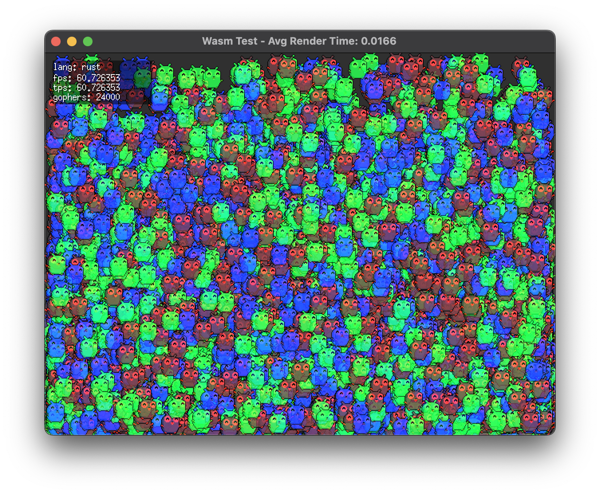

# Wasm Game Engine Test

This repository was created to see how feasible it is to use [wazero](https://wazero.io/) to drive a small game engine (using [Ebitengine](https://ebitengine.org/)). It simply sets up Ebitengine and exports a small api for wasm to import.

If you're trying to do something similar, hopefully this provides a decent starting point.



## Installation

- Install the toolchain for the language you want to compile (zig, rust, odin, tinygo, assemblyscript)
- `cd` into their `[lang]-game` directory
- run `./build.sh` (this will create a `game.wasm` file in the root directory)
- run `go run .` in the root directory to start the game

## Some minor benchmarks

Below are a few grain-of-salt metrics I've gathered for each bunnymark-styled demo. This **isn't** intended to be a direct comparison of performance, more to see how much overhead there is when calling between wazero/wasm and go.

Note: these are on a 2022 M2 MacBook Air (8GB)

```
language   60fps max  avg fps after max
asc/wasm   22,000     ~25 (23,000)
zig/wasm   23,000     ~20 (24,000)
odin/wasm  23,000     ~20 (24,000)
go/wasm    24,000     ~30 (25,000)
rust/wasm  24,000     ~30 (25,000)
```

## License

Public Domain
